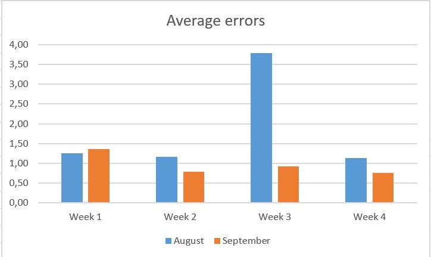

# Edited Assignment: Decision making

Task:

- Clients complain that the searches for a destinations sometimes fail. 
Head of product decided to address the issue, and ask development team to work on fix. 

- The team committed to work out the solution during August. 
It was agreed that the team’s bonus payout would depend on effectiveness of the solution.       

- **The Head of Product ask you to analyze the data and 
help him to decide whether the team deserve the bonus?**

- Your answer should be documented and submitted 
to the GitHub so that any changes can be easily tracked.

Useful context:

- Data for Barcelona destination *(18452212)* is representative, 
so that any conclusions can be extrapolated for other destinations.

# Decision

In order to decide whether or not workers deserve the bonus, I have computed the average of errors by total weekly users.

We obtain the following result:

|          | August   | September |
| :-------: | :------: | :-----:    |
| Week 1   | 1.26       | 1.35   |
| Week 2   | 1.17     | 0.79    |
| Week 3   | 3.79     | 0.93    |
| Week 4   | 1.14     | 0.76     |

**When analyzing the results, we found that only in the first week there was no decrease in the weekly error rate. As there is a tendency to decrease the error, we give the bonus to the workers.**

